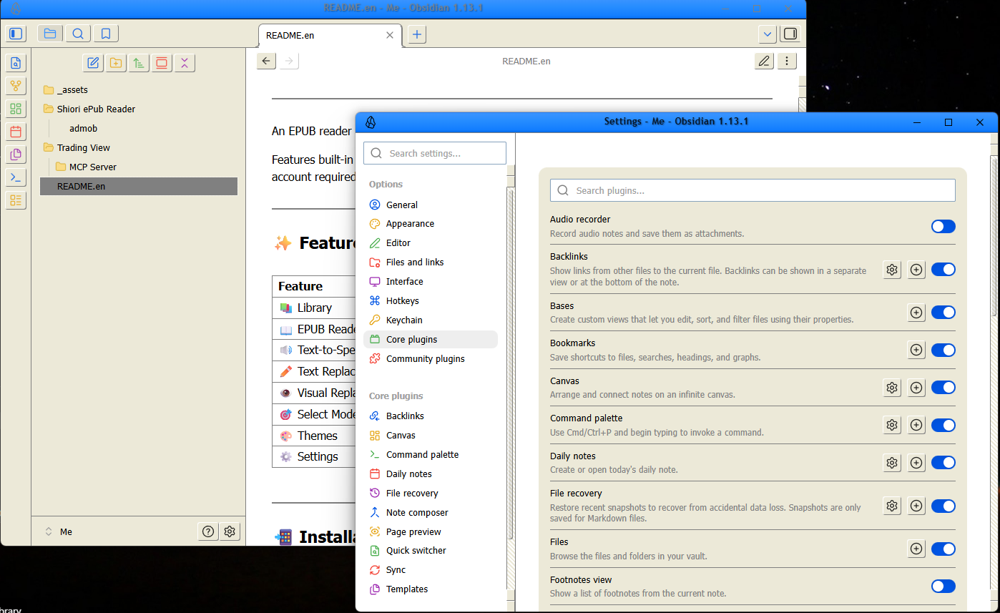
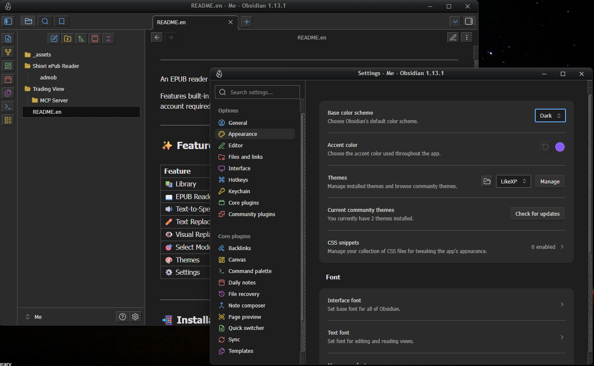
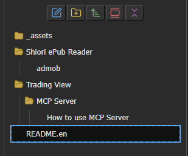

# LikeXP - Windows XP Theme for Obsidian

Bring back the nostalgia of the 2000s! **LikeXP** is a retro theme for Obsidian that carefully recreates the classic Windows XP aesthetic. It features the iconic Luna Blue for Light Mode and the sleek Royale Noir for Dark Mode.

## ✨ Features

- **Classic Luna Blue (Light Mode)**: Authentic `#ece9d8` window backgrounds, 3D beveled buttons, and the iconic blue titlebar gradient.
- **Royale Noir (Dark Mode)**: A sleek, dark gray aesthetic inspired by the official Windows XP Royale Noir theme, with high-contrast pastel blue accents for readability.
- **Retro UI Elements**:
  - Classic Windows 9x/XP style scrollbars with 3D thumbs.
  - Dropdown menus and inputs styled with flat `#7f9db9` borders (authentic Luna style) and classic blue focus rings.
  - Authentic dialog tabs and modal window designs.
- **Windows Explorer File Tree**: Replaces default Obsidian collapse arrows with classic Windows closed/open folder icons (📁/📂) in the File Explorer.

## 📸 Screenshots

*(Place your screenshot images inside the `image` folder to display them here)*

### Light Mode (Luna Blue)

### Dark Mode (Royale Noir)

### File Explorer & Icons

## 📥 Installation

### Manual Installation
1. Download the `theme.css` and `manifest.json` files.
2. Open your Obsidian vault directory.
3. Navigate to the `.obsidian/themes/` folder.
4. Create a new folder named `LikeXP` and place the downloaded files inside.
5. Open Obsidian, go to **Settings > Appearance > Themes**, click **Manage**, and select **LikeXP**.

## 🛠️ Customization

This theme is built using Obsidian's CSS variables combined with custom XP variables. If you wish to tweak colors (e.g., change the accent color or background), you can easily edit the variables at the very top of the `theme.css` file:

- Edit the `body { ... }` block to change **Light Mode** colors.
- Edit the `.theme-dark { ... }` block to change **Dark Mode** colors.

## 📝 Changelog

### v1.0.5
- **Fix**: Synchronized the `--header-height` across the entire app to exactly `40px` to permanently resolve the physical overlap between the titlebar and workspace elements (tabs and ribbon icons).

### v1.0.4
- **Hotfix**: Completely redesigned the overlap fix. The top of the workspace (tabs and arrows) is now properly pushed down to prevent the opaque titlebar from slicing it. Also applied a bulletproof rule to hide any stray title text.

### v1.0.3
- **Fix**: Completely resolved the issue where the titlebar and its bottom border overlapped with the tab headers in modern Obsidian versions.
- **Fix**: More aggressive CSS targeting to hide the centered window title (`.titlebar-text` and variants) to prevent overlap.

### v1.0.2
- **Update**: Minor internal version bump and adjustments.

### v1.0.1
- **Fix**: Hid the titlebar text (`.titlebar-text`) to prevent it from overlapping with workspace tabs when using hidden window frames.
- **Fix**: Corrected toggle switch colors so the "off" state (gray) and "on" state (blue) are distinguishable.

## 💖 Support / Donate

If you enjoy the nostalgia of this theme and would like to support its continued development, consider buying me a coffee or supporting the project!

- [Buy Me a Coffee](https://www.buymeacoffee.com/) (Placeholder link)
- [Ko-fi](https://ko-fi.com/) (Placeholder link)

## 📝 License

MIT License
